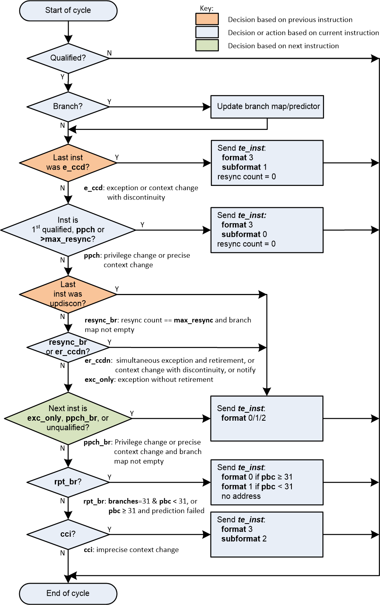

[[Algorithm]]
== Reference Compressed Branch Trace Algorithm

The contents of this chapter are informative only.

A reference algorithm for compressed branch trace is given in
<<fig:algo>>. In the diagram, the following terms are used:

* _te_inst._ The name of the packet type emitted by the encoder (see
<<packets>>);
* _inst._ Abbreviation for 'instruction';
* _exception. Exception or interrupt signalled;_
* _updiscon._ Uninferable PC discontinuity. This identifies an
instruction that causes the program counter to be changed by an amount
that cannot be predicted from the source code alone (*itype* values 8,
10, 12 or 14);
* _Qualified?_ An instruction that meets the filtering criteria is
qualified, and will be traced;
* _Branch?_ Is the instruction a branch or not (*itype* values 4 or 5);
* _branch map._ A vector where each bit represents the outcome of a
branch. A 0 indicates the branch was taken, a 1 indicates that it was
not;
* _ppccd._ Privilege has changed, or context has changed and needs to be
reported precisely or treated as an uninferable PC discontinuity (see
<<tab:context-type>>);
* _ppccd_br._ As above, but branch map not empty;
* _er_n._ Instruction retirement and exception signalled on the same
cycle, or Trace notify trigger (see
<<tab:debugModuleTriggerSupport>>);
* _exc_only._ Exception or interrupt signalled without simultaneous
retirement;
* _cci._ context change that can be reported imprecisely (see
<<tab:context-type>>);
* _rpt_br._ Report branches due to full branch map or misprediction;
* _branches._ The number of branches encountered but not yet reported to
the decoder;
* _pbc._ Correctly predicted branches count (always zero if branch
predictor disabled or not present);
* _Reported?_ "Exception previous" reported with *thaddr* = 0 on the
cycle it occured because it was preceded by an updiscon or immediately
followed by another exception;
* _resync count._ A counter used to keep track of when it is necessary
to send a synchronization packet (see <<sec:resync>>);
* _max_resync._ The resync counter value that schedules a
synchronization packet (see <<sec:resync>>);
* _resync_br._ The resync counter has reached the maximum value and
there are entries in the branch map that have not yet been output (see
<<sec:resync>>).

<<fig:algo>> shows instruction by instruction behavior, as
would be seen in a single-retirement system only. Whilst the core to
encoder interface allows the RISC-V hart to provide information on
multiple retiring instructions simultaneously, the resultant packet
sequence generated by the encoder must be the same as if retiring one
instruction at a time.

A 3-stage pipeline within the encoder is assumed, such that the encoder
has visibility of the current, previous and next instructions. All
packets are generated using information relating to the current
instruction. The orange diamonds indicate decisions based on the
previous instruction, the green diamond indicates a decision based on
the next instruction, and all other diamonds are based on the current
instruction.

Additionally, the encoder can generate one further packet type, not
shown on the diagram for clarity. The _support_ packet (format 3,
subformat 3 - see <<sec:format33>>) is sent when:

* The encoder is enabled or disabled, or its configuration is changed,
to inform the decoder of the operating mode of the encoder;
* After the final qualified instruction has been traced, to inform the
decoder that tracing has stopped;
* If trace packets are lost (for example if the buffer into which
packets are being written fills up), in this situation, the 1st packet
loaded into the buffer when space next becomes available must be a
_support_ packet. Following this, tracing will resume with a sync
packet.

Note: if the *inhibit* vector indicates tracing inhibition or *reset* signal is asserted (see
<<tab:ingress-side-band>>) the encoder will behave as if it has received an unqualified instruction (output _te_inst_ reporting the address of the previous instruction, followed by
_te_support_);

[[fig:algo]]
.Instruction delta trace algorithm

=== Format selection

In all cases but two, the packet format is determined only by a 'yes'
outcome from the associated decision.

When reporting branch information on its own (without an address), the
choice between format 1 and format 0, subformat 0 depends on the number
of correctly predicted branches (this will be 0 if the predictor is not
supported, or is disabled). No packets are generated until there are at
least 31 branches to report. Format 1 is used if the outcome of at least
one of those 31 branches was not predicted correctly. If all were
predicted correctly, nothing is output at this time, and the encoder
continues to count correctly predicted branch outcomes. As soon as one
of the branch outcomes is not correctly predicted, the encoder will
output a format 0, subformat 0 packet. See also
<<sec:format0>>.

The choice between formats for the "format 0/1/2" case in the middle of
the diagram also needs further explanation.

* If the number of correctly predicted branches is 31 or more, then
format 0, subformat 0 is always used;
* Else, if the jump target cache is supported and enabled, and the
address being reported is in the cache, then normally format 0,
subformat 1 will be used, reporting the cache index associated with the
address. This will include branch information if there are any branches
to report. However, the encoder may chose to output the equivalent
format 1 or 2 packet (containing the differential address, with or
without branch information) if that will result in a shorter packet (see
<<sec:format0>>);
* Else, if there are branches to report, format 1 is used, otherwise
format 2.

Packet formats 0, 1 and 2 are organized so that the address is usually
the final field. Minimizing the number of bits required to represent the
address reduces the total packet size and significantly improves
efficiency. See <<packets>>.

[[sec:resync]]
=== Resynchronisation

Per <<sec:synchronization>>, a format 3
synchronisation packet must be output after "a prolonged period of
time". The exact mechanism for determining this is not specified, but
options might be to count the number of _te_inst_ packets emitted, or
the number of clock cycles elapsed, since the previous synchronization
message was sent.

When the resync is required, the primary objective is to output a format
3 packet, so that the decoder can start tracing from that point without
needing any of the history. However, if the decoder is already synced,
then it is also required that it can continue to follow the execution
path up to and through the format 3 packet seamlessly. As such, before
outputting a format 3 packet, it is necessary to output a format 1
packet for the preceding instruction if there are any unreported
branches (because format 3 does not contain a branch map). The format 3
will be sent if the resync timer has been exceeded. On the cycle before
this (when the resync timer value has been exactly reached), a format 1
will be generated if the branch map is not empty.

[[rec:multiretcon]]
=== Multiple retirement considerations

As noted earlier in this section, for a single-retirement system the
reference algorithm is applied to each retired instruction. When
instructions are retired in blocks, only the first and last instruction
in a block need be considered, as all those in between are
"uninteresting", and will have no effect on the encoder's state (their
route through <<fig:algo>> does not pass through any of the
rectangular boxes).

In most cases, either the first or last instruction of a block (but not
both) is interesting, meaning that the encoder does not need to generate
more than one packet from a block. However, there are a few cases where
this is not true, and it is possible that the encoder will need to
generate two packets from the same block.

For example, the first instruction in a block must generate a packet if
it is the first traced instruction. However, if the block also indicates
an exception or interrupt (**itype**= 1 or 2), then the last instruction
in the block must also generate a packet.

As generating multiple packets per cycle would significatly complicate
the encoder, and as situations such as this will only occur
infrequently, some elastic buffering in the encoder is the preferred
approach. This will allow subsequent blocks to be queued whilst the
encoder generates two successive packets from a block. The encoder can
drain the elastic buffer any time there is a cycle when the hart doesn't
report anything, or if there is a block with *itype* = 0 (which is
uninteresting to the encoder).

There are pathological cases where consecutive blocks could require
packets to be generated from both first and last instructions, but
elastic buffering is only required if the blocks are also input on
consecutive cycles. In practice there are very few cases where this can
occur. The worst so far identified case is a variation on the example
above, where the exception is an ecall, and that in turn encounters some
other form of exception or interrupt in the first few instructions of
the trap handler:

* Block 1: *itype* = 1 (ecall), *iretires* > 1. Generate packet from
first instruction (first traced), and last instruction (last before
ecall);
* Block 2: *itype* = 1 or 2 (some other exception or interrupt),
*iretires* > 0. Generate packet from first instruction (ecall trap
handler), and last instruction (last before other exception or
interrupt);
* Block 3: Generate packet from first instruction (other exception or
interrupt trap handler)

Because the ecall is known to the hart's fetch unit and can be
predicted, it may be possible for block 2 to occur the cycle after block
1. However, it is reasonable to assume that the other exception or
interrupt will not be predictable, and as a result there will be several
cycles between blocks 2 and 3, which will allow the encoder to 'catch
up'. It is recommended that encoders implement sufficient elastic
buffering to handle this case, and if for some reason the elastic buffer
overflows, it should issue a support packet indicating trace lost.

